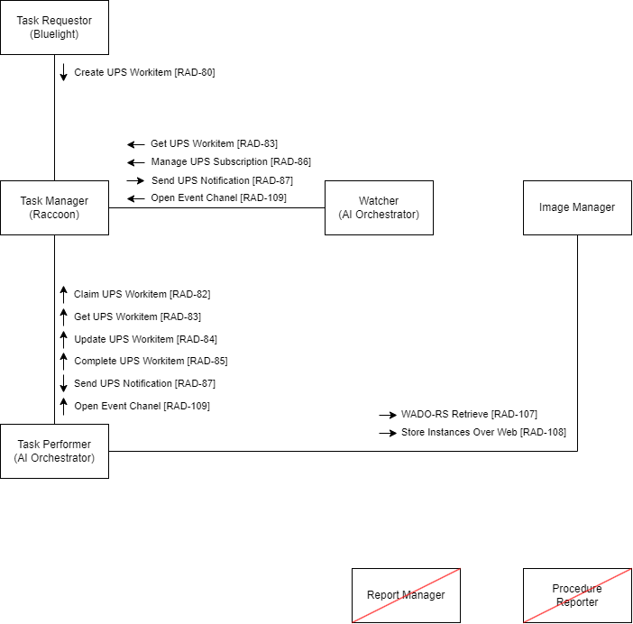
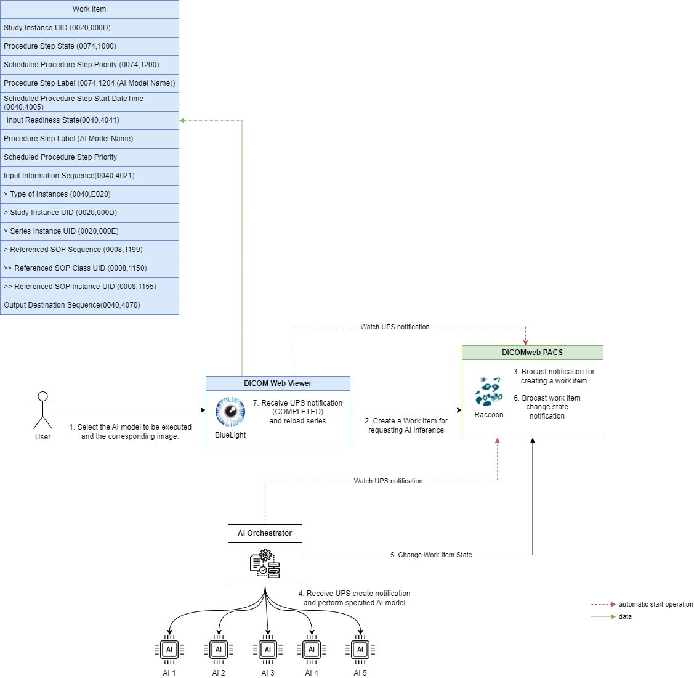

# ai-model-orchestrator

[English](./README.md) | **繁體中文**

本專案單純使用 DICOMweb 嘗試實作 IHE 當中的 [AIW-I](https://www.ihe.net/uploadedFiles/Documents/Radiology/IHE_RAD_Suppl_AIW-I.pdf) profile 的 Task Performer 角色

## 架構圖
### IHE Profile AIW-I Actor Diagram

### Workflow Diagram

## 使用素材
- DICOM Viewer: [BlueLight](https://github.com/cylab-tw/bluelight)
- PACS Server: [Raccoon](https://github.com/Chinlinlee/raccoon-dicom)

## Getting Start
This project was bootstrapped with [Fastify-CLI](https://www.npmjs.com/package/fastify-cli).

### Available Scripts

In the project directory, you can run:

#### `npm run dev`

To start the app in dev mode.\
Open [http://localhost:3000](http://localhost:3000) to view it in the browser.

#### `npm start`

For production mode

#### `npm run test`

Run the test cases.

### Learn More

To learn Fastify, check out the [Fastify documentation](https://fastify.dev/docs/latest/).

## 未來功能
- 新增前端
    - 支援用戶建立 BlueLight 上的 AI Service 選項的設置
    - 支援用戶建立 AI Orchestrator 上的 AI Model 的設置
- 新增獲取 AI Service 設置的 API
- BlueLight 新增檢視 Workitem (UPS) 的